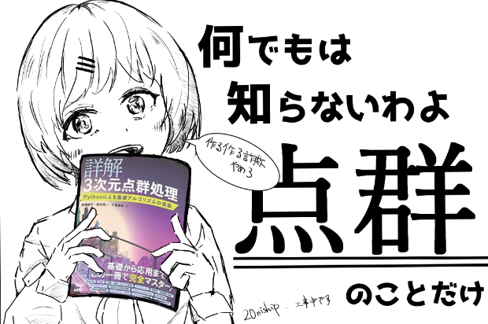

# 認識・経路探索・C++ドキュメント

- 以下のような内容を含んでいます：
  - 点群処理 : センサ類の基礎知識からセグメンテーション、フィッティングまで。ちょっと機械学習
  - 画像処理：いろいろ
  - 経路探索：RRT, MPC, 車両モデル
  - Computer Graphics：基礎知識と数学とOpenGLやVulkanについて、GLSLシェーダ芸とレイキャスティング
  - アーキテクチャ・デザイン
  - アルゴリズム：８分岐、最近某探索、凸法検出などの点群処理に必要な処理、実装
  - C++ Tips
    - 並列計算：GPUやCPUのマルチスレッドを使って並列計算する方法
    - C++のプロジェクトを作るときに最低限する必要があること
    - プログラムの処理速度の上げ方

## 目次
# Awesome Cognition Docs 

# Table of Contents

- 認識
  - 認識について
  - データの種類
 　　 - センサ一
  - センサヒュージョンとか
     - Kalman Filter
  - 確率的
  - SLAM
  - データの種類
  - 点群
    - セグメンテーション
    - ディテクション
    - データの種類()
    - Scene Reconstruction
    - フィッティング
    - テンプレートマッチング
    - その他（リンク）
    - SVM 
    - Deepな手法
      - PointNet
      - 便利なライブラリ
  - 画像
    - 画像処理する上で大事なこと
    - Deep
    - 物体の方に細工する（ARマーカー、点群の点）
- 制御
  - 古典制御
    - PID
    - H無限大
  - 現代制御
　- 車両モデル
　- 経路生成
　  - ダイクストラ法
　  - Aスター法
  　- MPC
  - 経路追従
    - aaaaa 
    - delanuy分割
- Computer Graphics
  - 基礎（数学）
　- OpenGL
　- Vulkan
　- シェーダー言語
- ソフトウェア設計
  - デザインパターン
    - Entity Component System
  - 最適化
  - GitHubでのデプロイ方法
  - デバッグ方法
    - gdb, 
    - memory leakcheck
    - Garbage collection
    - 速度のネックになっている部分を見つけ出す（プロファイリング）
    - CodeCov
 - API設計
 - 
- アルゴリズム（競プロ的なもの）
  - stdを作ってみる
    - vector
    - matrix
    - pool
    - list
    - stack, queue
 - Octree
 - sort
 - ベジエ曲線、スプライン補完
   - イージングの話
 - aaa
- その他
  - RoboTechERが自作PCをするなら
  - SolidWorksのプラグインを書こう！
  - vim
- 通信（RC22のWebControllerについて）
- Admin
  - MediaWikiからGROWIに移行しようとした話
  - 自宅サーバー
  - Slackとのインテグレーション
  - Webサイト監視（QibanとかNHKロボコンのサイトチェックとかに使われてる）
- MovUtlについて
  - 環境構築
  - Hello World
  - Examples
- 物理エンジンの作り方
  - 衝突判定

# 書きたいこと
- カメラパラメータの話（行列とかF値とか）
- CAPE (Fast Cylinder Detection)
- RANSAC
- DBSCAN
- Region Growing
- ドメイン最適化
- Surface Reconstrction
- OMNIX
- SIMD, BLAS
- プログラムの高速化
  - forループ
  - キャッシュ
  - SIMD,　BLAS
  - OpenCLやOpenGLのCompute Shader
  - OpenMP
  - マルチスレッド
    - 排他制御
  - Cppでのロギング方法
  - GRPC
春ロボのGUI（Rustだっけ？）

# 点群（Deep）

## データセット
### segmentation

### detection 

## モデル
### segmentation

### detection

## Github Repository

# 認識について

そもそも認識ってどんなときに使うの？という話から。
大まかに2つ

- 自分のいる位置を確認する　
- オブジェクトを検出する
- ↑これには地図データなども含む。周りの環境について知る、という意味

があると思う。んで、両者を同時に行うSLAMなんていう方法もある

まずは何を認識する必要があるのかを決めて、そっから適切なセンサと認識アルゴリズムを選択すると良さそう

## 得られる情報とそのセンサ一覧

最初は古典的なものから段々高価なもの（センサから得られる情報量がおおいもの）の順で書いていきます

ここではエンコーダなど物理的なセンサは省略します

### 一点の明るさ、色など

- ラインセンサ
- フォトトランジスタ

### 一点の距離

- ラインセンサ
- 超音波センサ
- レーザ

### 画像（二次元）
カメラ　と一言でいえるけれど性能によって色々違いがある
F値

- LiDAR 
- RGBDカメラ
- 

# 点群認識, RGBD画像の認識

## デバイス一覧
Kinect, Realsenseなどがある。近年はIphoneにも高性能のLiDARが搭載されていて、それを使用するという案も検討された

### Kinect 

###Realsense

# RG

# 画像認識

古典的な手法(機械学習を使わないアルゴリズム)
- Primitiveを検出する
  - Hough変換
    - 確率的Hough変換
- 
- Cascade
- 特徴量から頑張る
- その他
  - SFM, フォトグラメトリ
  - 

OpenCVのライブラリモジュールを調べながら書く

# 便利なライブラリ

- imgui 
- VTK
- OpenCV 
- googletest 
- pybind
- bullet
- 

## Commands

* `mkdocs new [dir-name]` - Create a new project.
* `mkdocs serve` - Start the live-reloading docs server.
* `mkdocs build` - Build the documentation site.
* `mkdocs -h` - Print help message and exit.

## Project layout

    mkdocs.yml    # The configuration file.
    docs/
        index.md  # The documentation homepage.
        ...       # Other markdown pages, images and other files.

!!! Note
    これはノートです。

!!! Tip
    ヒントです。

!!! Warning
    これは警告です
    
!!! Danger
    これは危険です。

-------------画像テスト---------

<!-- -->

-------------画像テスト終わり---------
