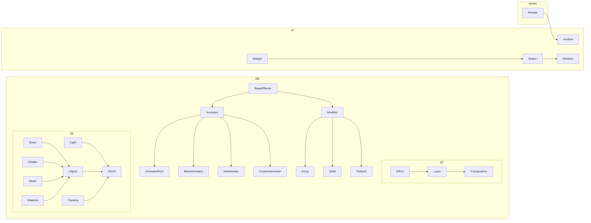

# データ構造/ファイル構造

## namespace structure




# Documentation以前

- `DataView`と`Data`に分かれている
  - `Data`には実際のデータがバイナリ形式で格納されており、`DataView`にはそのデータへのポインタと使い方がある
- `DataView`一つに付き、1つの`Data`オブジェクトが存在する

```cpp
class DataView{
    ID2{
        DataType type; // Scene, Object, World, Effect, Custom ...... (ここによってUIの挙動が変化する)
        uint64_t type2; // 
        int size_in_bytes;
    } id;
    Data *ptr;
	Keyframe *key;
    py_instance *inst; // if neccesary
};

class Data{
    Data() = default;
    ID id;
    char name[60];
}

class ObjectData : public Data{
	DataView *effects;
}

class SceneData : public Data{
	int width, int height;
    DataView *objects;
}

std::vector<DataView> scenes, world, objects, effects....;

```

