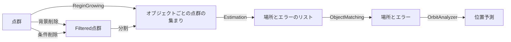
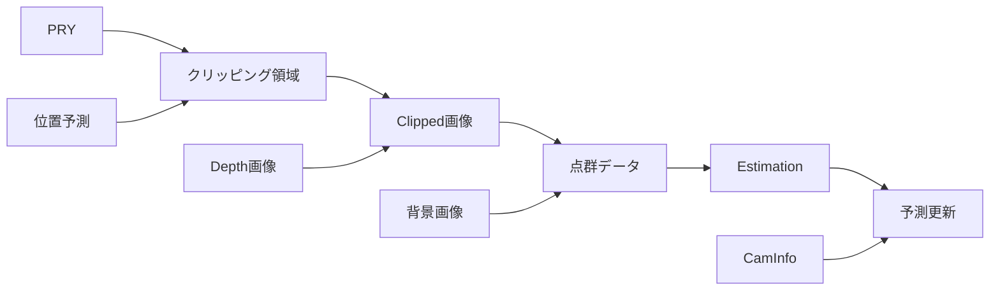
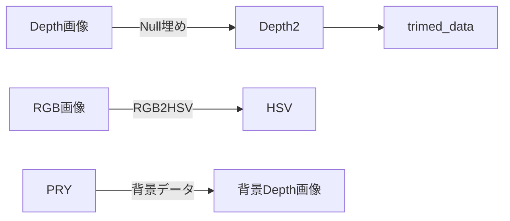

# RGB-Dの処理について書いていく


Fig 1..[cosyposeでの3D物体認識の例](https://github.com/ylabbe/cosypose)

ここでは6D pose (3D位置の3パラメータと姿勢3パラメータで6Dかな)の予測について書いていく。


## 概要（主な手法一覧）

大きく分けると、現在画像データからオブジェクトの位置と姿勢を認識する方法は以下がある

- 機械学習を使う
  - keypoint based
  - holistic
  - RGB-Dを使用したもの
- 機械学習を使わない
  - RGB画像に基づくもの
  - RGB-D画像に基づくもの
    - RANSAC（Depthのみでも可）
    - [CAPE](https://arxiv.org/pdf/1803.02380.pdf)


## ライブラリ

- [PCL](https://pointclouds.org/)
  - Point Cloud Libraryの略。点群データ処理といったらこれ
  - RANSAC
- [LMNet](https://github.com/val-iisc/3d-lmnet)
- 


以下では、RGBDの機械学習を使用しない方法について書く


手元にあったデータで地面除去とクラスタリングを動かしてみました．これで処理時間は30~50msぐらいでした．
センサはvelodyne社のHDL-64E，地面除去はコレ，クラスタリングはコレ．
https://youtu.be/IyGCe_TCS7Q

https://github.com/lorenwel/linefit_ground_segmentation


https://pcl.readthedocs.io/projects/tutorials/en/latest/cluster_extraction.html

ちなみに某社の地面除去はransac baseとray baseの2つあって使い分けている


https://blog.rogiken.org/blog/2021/02/01/rgb-depth%E3%82%BB%E3%83%B3%E3%82%B5%E3%82%92%E8%87%AA%E4%BD%9C%E3%81%97%E3%82%88%E3%81%86%E3%80%901-%E5%9F%BA%E7%A4%8E%E7%9F%A5%E8%AD%98%E7%B7%A8%E3%80%91/

https://qiita.com/yuzsh/items/42bb8ac904f5e9837599

https://www.geometrictools.com/Documentation/LeastSquaresFitting.pdf

https://www.jstage.jst.go.jp/article/jrsj/31/6/31_31_605/_pdf

https://link.springer.com/content/pdf/10.1007/s00006-017-0759-1.pdf

https://deepai.org/publication/beyond-farthest-point-sampling-in-point-wise-analysis


pcl::SampleConsensusModelCylinder<PointT, PointNT>::computeModelCoefficients (


## Trackingについていろいろ

必要な機能



- 分割：RegionManagerクラス
  - 内部に点群のindicesとかを持つ
  - ここで分割している自転でEstimationのupdate()を実行すること

例

```cpp
class ObjectEstimator{ 
    Vector3 pos, hogehoge, err
    virtual void update(Vector3 pos);
};
class CylinderEstimator : ObjectEstimator {.......}
class SphereEstimator : ObjectEstimator {.......}

template <typename MyEstimator>
class Cluster{
    int indices[];
    CloudRegion(Estimator * e){.....}
    MyEstimator estimator;
   	getError();
}

class Segmentor{
    void process(points *, CloudRegion *reg);
    int indices[]
}

Cluster<CylinderEstimator> clusters[10];
points cloud[10];
Segmentation seg;
OrbitAnalyzer oa;

int main(){
    seg.setCloud(cloud);
    seg.setClusters(clusters); // ここに代入される
    seg.extract();
    
    int n = seg(cloud); // 点群データからSegmentationをして、Clustersに代入する
    std::cout << n << "segments found!" << std::endl;
    
    for( auto s : segments ){ s.predict(); } // predict()により、それぞれのEstimatorが動き、位置等を予測
    
    oa(clusters); // orbit Analyze！
}
```

### 2D画像処理
と思ったけど、高速化のためには最初に2Dで処理すべきか


- Depth画像→クリッピング画像を作るときに、同時にMinMaxのデータも取得する
- 背景画像の作成方法：
  - `void inline get_background_depth(Vector2 uv, Vecto3 pry) `として実装
  - 背景画像のresolutionを設定
  - クリッピング領域ないの背景画像を事前に作っておく？→10HZくらいで良さそう
  - 1280*800 のとき：
    - 50cmずつ→20*10

## Lagori認識についていろいろ

```cpp
/*それぞれのClusterについて合致するかどうかをチェックするときに*/
struct ClusterParam{
	std::string name;
	PrimitiveType type;
    int min_point_n, max_point_n;
    Vector3 min_hsv, max_hsv, min_rgb, max_rgb;
    Vector3 min_size, max_size;
    
    bool check()
};

struct Cluster{
	
};

class Lagori : Cluster{
	ClusterParam param_estimate;
	float err;
};

class ClusterManager {
  
}

```

```cpp
struct Point2D{
  Vector3b rgb;
  Vector3 pos_global, normal;
  uint8_t cluster_idx;
};

enum class ClusterPrimitibeType{
    Plane,
    Sphere,
    Cuboids,
    Cylinder
};

struct ClusterType{
    std::string name;
    ClusterPrimitiveType type;
}

std::vector<ClusterType> field_objects;

struct Cluster{
#ifdef MAGI2D_USE_POINTER_INDICES
    uiVector<Point2D *> indices;
#else
    uiVector<uint32_t> indices;
#endif
    std::vector<FittingBase *>fittings;
public:
    operator <<(const Point2D *){
        
    }
	void calc(){
        for(int i=0; i<fittings.size(); i++){
			fittings[i].estimate();
        }
    }
};

class LagoriDetection{
  std::vector<Cluster> clusters;
    
};
```


## TODO

- // TODO: で検索


## 手法とか

### ハズレ値除去

#### Learning based approach
- 教師あり方式
	- 異常値検出を分類問題としてモデル化する。専門家が調査したサンプルを学習とテストに使用。
	- 課題
		- 学習データのアンバランス。外れ地の母集団は、通常、正常なオブジェクトの母集団よりもはるかに小さい。→オーバーサンプリングなど、不均衡なクラスを処理する必要がある
- 半教師付き手法
	- 多くのアプリケーションにおいて、ラベル付けされたサンプルを得ることは可能であるが、その数は少ないことが多い。もし、ラベル付きの正常な物体があれば、それを利用する。
	- ラベル付けされた例と近傍のラベル無しオブジェクトを使用して、正常オブジェクトのモデルを学習する。
	- 正常物のモデルに当てはまらないものは外れ値として検出する

#### それ以外
- 条件→正常な物体はある程度 "クラスター化 "している。
  - 言い換えれば，教師なし異常値検出法は，正常なオブジェクトは異常値よりもはるかに頻繁にパターンに従うことを期待
  - 課題
    - 正常なオブジェクトは強いパターンを共有しないが、外れ値の集団は狭い範囲で高い類似性を共有する可能性がある。
    - また、通常の活動が多様で、質の高いクラスタに分類されない場合、教師なし手法は誤検出率が高く、多くの実際の外れ値を検出できない可能性がある。
- 密度ベースの方法
  - https://towardsdatascience.com/density-based-algorithm-for-outlier-detection-8f278d2f7983

### Downsampling

- 見たい領域の外側を除去する方法
- 


### Clustering

- Region growing
- DBSCAN
- 


### Detection( estimate primitive )


# 2Dでいけるんじゃね？

## 背景

- 3Dの処理に結構時間がかかる
  - BHの方には50FPSくらいかかる
- PCLと点群処理ライブラリ（Magi namespace）と描画エンジン（vkUI namespace）の間のデータ移動が面倒
  - `PointCloud<pcl::PointXYZRGB>`と、`std::vector<Vector3>`とGLMの互換性
- PCLのmakeが遅い
- Cylinderの兼出は最小二乗法で行けるけれど、円（Lagoriの上面）の検出はそうは行かない
  - とらえられる点群が円の麺の一部分しかないので、変な感じになりそう
  - →面のEdgeをみれば良くない？
  - alphashapeとか見てたけど、いろいろ考えてたらこの結論に至った

→2Dのまま処理して、最後だけ三次元空間に落とし込む方法でいけないか？

## アルゴリズム



- RGB, HSVそれぞれについてエッジ抽出
  - この際、Depthの値が飛んでいる部分（0、65535等）担っている部分は周囲のデータをもとに埋めておく
  - RGBの方はブラー処理をする
- RGBとDepthのEdge画像を合成
  - このままだと大量にいらないedgeが作成される
    - Method1.：RGBとDepth両方に現れているエッジを探す
      - それぞれのカメラのMetricsが完全に一致している必要がある？
    - サイズ：各エッジについてサイズが小さいものを除去
      - それをするならRGBDのVector4を作ってRegionGrowingしたほうが早そう
- edge抽出が完了したら、、、それぞれのEdgeについて：
  - XYZデータも追加し、Cylinder、Sphere、Planeのフィッティングを行う
  - 色でそもそも区別つける（白っぽかったらPlaneからやって、赤/青ならCylinderするとか
  - ものがわかったら完了
- ２つのRegionで共有するエッジがあるので、そこはRegionGrowingできると嬉しい。。
  - 側面と底面のEdge
- Edgeの種類
	- 本当は「Edge」ではない部分も存在する（円柱の側面部分など）
    - 3D的に考えるとに種類のEdgeが存在する
    	- 「物体のEdge（凸Edge？）」：物体のborder
    	- 物体のSurfaceの向きが変化することによるEdge：物体中のEdge
    	- この２つをうまく区別しながらSegmentationする必要が、、、、ないか

Segmentationの手法
- まあRegionGrowingでいいんじゃない？

- Fitting
	- 平面
		- 円
		- 四角形
	- 円柱
	- 球体


## 法線ベクトル検出


## 実装

- これまでの3Dの実装は、Namespaceを`Magi` から`Magi::2D`に変更する


 ## Cylinder Fitting

にゃん。//TODO: はよ書けやおい

### Method 1. ( by normal)


### Mehod 2. (by Convariance matrix)


